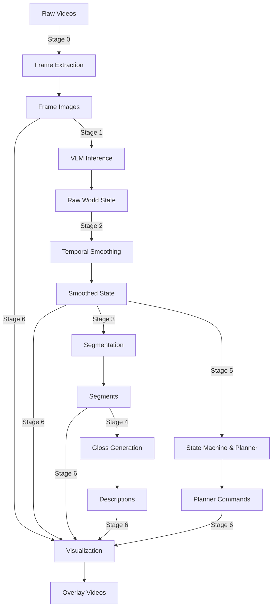

# Driving World Model

Modern autonomous driving systems increasingly use end-to-end neural networks that map sensory input directly to control actions. These approaches are powerful but provide limited access to intermediate reasoning. Classical robotics pipelines decompose perception, planning, and control into modular components, enabling transparency and debugging at the cost of manual subsystem engineering.

This project takes a hybrid approach. A Vision-Language Model (VLM) converts dashcam video into **symbolic world states** that describe:
- **affordances** (go, wait, stop)
- **yield relations** (none, lead, pedestrian)
- **lead vehicle dynamics** (moving, stopped)

These predictions are then temporally smoothed, segmented into behavioral phases, translated into planner commands, and paired with short natural language glosses.

The outcome is an interpretable **Driving World Model ** that bridges perception and planning and can be visualized.

## What This Does

This system answers three key questions about any driving scene:

| Question | Field | Values |
|----------|-------|--------|
| What can the ego vehicle safely do? | `affordance` | go / wait / stop |
| What is constraining it? | `yield_to` | none / lead / ped |
| What is the lead vehicle doing? | `lead_state` | none / moving / stopped |

Unlike end-to-end driving networks that output raw control signals, this produces **symbolic, human-readable states** that bridge perception and planning—enabling reasoning, debugging, and human validation.

## Pipeline Overview

```
Raw Video → Frames → VLM Analysis → Smoothing → Segmentation → Planner Commands → Visualization
```



## Quick Start

### Prerequisites

```bash
pip install -r requirements.txt
export ANTHROPIC_API_KEY="your-api-key"
```

### Run the Full Pipeline

```bash
# Process a single clip
python main.py --clip clip1

# Process all clips
python main.py --all

# Force recompute (ignore cache)
python main.py --all --force
```

## Pipeline Stages

### Stage 0: Frame Extraction
**Module:** `extract_frames.py`

Extracts frames from MP4 videos at fixed intervals.

### Stage 1: VLM Inference
**Module:** `run_vlm_inference.py` → `vlm_infer.py`

Uses Claude to analyze each frame and output a 3-field world state with explanations. Rate-limited to avoid API throttling.

**Output:** `world_state_claude.csv`

### Stage 2: Temporal Smoothing
**Module:** `temporal_smoothing.py`

Applies sliding-window majority vote (default: 3 frames) to reduce per-frame noise while preserving temporal structure.

**Output:** `world_state_claude_smoothed.csv`

### Stage 3: Segmentation
**Module:** `segment_world_state.py`

Groups consecutive frames with identical states into segments and assigns phase labels (e.g., "STOP behind vehicle", "FOLLOW moving lead").

**Output:** `world_state_segments.csv`

### Stage 4: Gloss Generation
**Module:** `generate_segment_gloss.py`

Uses Claude to generate natural language descriptions for each segment (e.g., "pedestrian crossing ahead").

**Output:** `segment_gloss.csv`

### Stage 5: State Machine & Planner
**Module:** `build_state_and_planner.py`

Builds a symbolic state machine, reinjects brief "GO" opportunities that smoothing may have removed, and generates planner commands (FOLLOW, GO, WAIT, STOP, YIELD).

**Output:** `planner_commands.csv`, `world_state_machine.csv`, `world_state_final.csv`

### Stage 6: Visualization
**Module:** `overlay_world_state.py`

Creates MP4 videos with HUD overlays showing frame info, phase labels, scene descriptions, world state, and planner intent.

**Output:** `results/{clip}_overlay.mp4`

## Project Structure

```
driving-affordance-world-model/
├── main.py                     # End-to-end pipeline driver
├── src/
│   ├── extract_frames.py       # Stage 0
│   ├── run_vlm_inference.py    # Stage 1 (orchestrator)
│   ├── vlm_infer.py            # Stage 1 (inference logic)
│   ├── temporal_smoothing.py   # Stage 2
│   ├── segment_world_state.py  # Stage 3
│   ├── generate_segment_gloss.py # Stage 4
│   ├── build_state_and_planner.py # Stage 5
│   ├── overlay_world_state.py  # Stage 6
│   ├── eval_world_model.py     # Evaluation
│   └── schema.py               # Data schema definitions
├── data/
│   ├── raw_videos/             # Input MP4 files
│   ├── frames/                 # Extracted frame images
│   ├── predictions/            # All intermediate CSVs
│   └── labels/                 # Human annotations (optional)
└── results/                    # Output overlay videos
```

## Running Individual Stages

```bash
python -m src.extract_frames
python -m src.run_vlm_inference
python -m src.temporal_smoothing
python -m src.segment_world_state
python -m src.generate_segment_gloss
python -m src.build_state_and_planner
python -m src.overlay_world_state --clip clip1 --fps 2
python -m src.eval_world_model
```

## Evaluation

`eval_world_model.py` compares predictions against human-annotated ground truth in `data/labels/` to compute:
- Accuracy metrics
- Safety-critical error rates
- Per-field performance breakdowns

## Data Flow

| Stage | Input | Output |
|-------|-------|--------|
| 0 | `raw_videos/*.mp4` | `frames/{clip}/frame_*.jpg` |
| 1 | Frame images | `world_state_claude.csv` |
| 2 | Raw predictions | `world_state_claude_smoothed.csv` |
| 3 | Smoothed predictions | `world_state_segments.csv` |
| 4 | Segments | `segment_gloss.csv` |
| 5 | Smoothed + segments | `planner_commands.csv`, `world_state_machine.csv` |
| 6 | All above | `results/{clip}_overlay.mp4` |

## Key Dependencies

- `anthropic` - Claude VLM API
- `opencv-python` - Video/frame processing
- `Pillow` - Image processing
- `moviepy` - Video generation
- `pandas`, `numpy` - Data processing

## Use Cases

- VLM-based world modeling research for autonomous driving
- Validating vision-language models in safety-critical applications
- Building interpretable intermediate representations between perception and planning
- Foundation for semantic planners that consume VLM-derived world states
